# Pokemon-Game
- [Pokemon-Game](#pokemon-game)
  - [Reto 1](#reto-1)
    - [1. Crea y configura tu repositorio de Github para la aplicación](#1-crea-y-configura-tu-repositorio-de-github-para-la-aplicación)
    - [2. Crea un proyecto en VueJS](#2-crea-un-proyecto-en-vuejs)
      - [¿Para qué sirve Vue Router, Pinia, Vitest, ESLint y Prettier?](#para-qué-sirve-vue-router-pinia-vitest-eslint-y-prettier)
      - [Para continuar, ejecutamos los comandos y comprobamos que nuestra aplicación VueJS funciona correctamente.](#para-continuar-ejecutamos-los-comandos-y-comprobamos-que-nuestra-aplicación-vuejs-funciona-correctamente)
      - [¿Qué es Composition API y en qué se diferencia de Option API en VueJS?](#qué-es-composition-api-y-en-qué-se-diferencia-de-option-api-en-vuejs)
      - [¿Qué es screaming architecture y qué ventajas tiene?](#qué-es-screaming-architecture-y-qué-ventajas-tiene)
    - [Ahora, vamos a modificar y borrar todo lo que no necesitamos que nos ha creado de forma automática VueJS](#ahora-vamos-a-modificar-y-borrar-todo-lo-que-no-necesitamos-que-nos-ha-creado-de-forma-automática-vuejs)
      - [Vaciar App.vue](#vaciar-appvue)
      - [Recuerda que vamos a utilizar TS en lugar de JS, ¿cómo se lo indicamos a Vue?](#recuerda-que-vamos-a-utilizar-ts-en-lugar-de-js-cómo-se-lo-indicamos-a-vue)
      - [Añade un mensaje de Hola mundo en App.vue](#añade-un-mensaje-de-hola-mundo-en-appvue)
      - [En la carpeta de assets, borra los archivos base.css y logo.svg](#en-la-carpeta-de-assets-borra-los-archivos-basecss-y-logosvg)
      - [Cambia el nombre de main.css de la carpeta assets a styles.css y modifica la ruta en el archivo main.ts para que funcione correctamente nuestra hoja de estilo](#cambia-el-nombre-de-maincss-de-la-carpeta-assets-a-stylescss-y-modifica-la-ruta-en-el-archivo-maints-para-que-funcione-correctamente-nuestra-hoja-de-estilo)
      - [Ejecuta el comando npm run dev y muestra el resultado](#ejecuta-el-comando-npm-run-dev-y-muestra-el-resultado)
    - [Para realizar nuestra aplicación en lugar del framework de CSS Bootstrap, vamos a usar Tailwind CSS, ¿lo conoces?](#para-realizar-nuestra-aplicación-en-lugar-del-framework-de-css-bootstrap-vamos-a-usar-tailwind-css-lo-conoces)
      - [Configura el proyecto para hacer uso de Tailwind CSS.](#configura-el-proyecto-para-hacer-uso-de-tailwind-css)
      - [Muestra el nuevo resultado del mensaje Hola mundo que creamos anteriormente, ¿se parece a esto?](#muestra-el-nuevo-resultado-del-mensaje-hola-mundo-que-creamos-anteriormente-se-parece-a-esto)
  - [Reto 2](#reto-2)
    - [Anteriormente, ya habíamos borrado y modificado un par de archivos, pero, ¿cumplimos con la filosofía de screaming architecture? Te digo la respuesta, no. Por tanto, vamos a seguir modificando nuestra estructura del proyecto:](#anteriormente-ya-habíamos-borrado-y-modificado-un-par-de-archivos-pero-cumplimos-con-la-filosofía-de-screaming-architecture-te-digo-la-respuesta-no-por-tanto-vamos-a-seguir-modificando-nuestra-estructura-del-proyecto)
      - [Sin miedo, borramos por completo la carpeta de components.](#sin-miedo-borramos-por-completo-la-carpeta-de-components)
      - [Crea una nueva carpeta dentro de src llamada modules, y dentro de esta una llamada pokemon, de tal forma que tendríamos src/modules/pokemon.](#crea-una-nueva-carpeta-dentro-de-src-llamada-modules-y-dentro-de-esta-una-llamada-pokemon-de-tal-forma-que-tendríamos-srcmodulespokemon)
    - [Dentro de la carpeta de pokemon vamos a tener todos los archivos que estén relacionados con nuestro juego de pokemon. La mayor parte de nuestro código irá dentro de esta carpeta.](#dentro-de-la-carpeta-de-pokemon-vamos-a-tener-todos-los-archivos-que-estén-relacionados-con-nuestro-juego-de-pokemon-la-mayor-parte-de-nuestro-código-irá-dentro-de-esta-carpeta)
      - [Creamos una nueva carpeta llamada composables, ¿qué es un composable en VueJS y cual es la nomenclatura común que se utiliza en los ficheros que contiene?](#creamos-una-nueva-carpeta-llamada-composables-qué-es-un-composable-en-vuejs-y-cual-es-la-nomenclatura-común-que-se-utiliza-en-los-ficheros-que-contiene)
      - [Creamos una nueva carpeta llamada components.](#creamos-una-nueva-carpeta-llamada-components)
      - [Creamos una carpeta de views.](#creamos-una-carpeta-de-views)
    - [Dentro de la carpeta de views, vamos a crear el archivo PokemonGame.vue, ¿cuál crees que será la lógica que irá dentro de este archivo?](#dentro-de-la-carpeta-de-views-vamos-a-crear-el-archivo-pokemongamevue-cuál-crees-que-será-la-lógica-que-irá-dentro-de-este-archivo)
      - [Genera la estructura básica de vue dentro de este archivo. Recuerda que estamos trabajando con Typescript y Composition API.](#genera-la-estructura-básica-de-vue-dentro-de-este-archivo-recuerda-que-estamos-trabajando-con-typescript-y-composition-api)
      - [¿Conoces algún atajo para generar esta estructura de forma automática? ¿Con qué extensión y cuál?](#conoces-algún-atajo-para-generar-esta-estructura-de-forma-automática-con-qué-extensión-y-cuál)
    - [Usando la etiqueta  de HTML, vamos a dividir nuestro template. Tendremos:](#usando-la-etiqueta--de-html-vamos-a-dividir-nuestro-template-tendremos)
      - [Una sección que tenga un mensaje que indique al usuario que: Espere por favor y Cargando Pokémons. De tal manera que:](#una-sección-que-tenga-un-mensaje-que-indique-al-usuario-que-espere-por-favor-y-cargando-pokémons-de-tal-manera-que)
      - [¿Para qué sirven las clases que hemos añadido?](#para-qué-sirven-las-clases-que-hemos-añadido)
    - [Saca una captura de como se ve actualmente nuestra aplicación. ¿No ves los cambios? Algo se te olvida... ¿qué es? Indica los archivos que has tenido que modificar.](#saca-una-captura-de-como-se-ve-actualmente-nuestra-aplicación-no-ves-los-cambios-algo-se-te-olvida-qué-es-indica-los-archivos-que-has-tenido-que-modificar)
      - [Si todo ha ido bien, tu aplicación tendría que verse tal que así:](#si-todo-ha-ido-bien-tu-aplicación-tendría-que-verse-tal-que-así)
      - [Utilizando una directiva de VueJS, ¿cómo ocultaríamos esta sección por completo?](#utilizando-una-directiva-de-vuejs-cómo-ocultaríamos-esta-sección-por-completo)
    - [Ahora, vamos a crear otra nueva sección igual a la anterior pero que muestre al usuario el mensaje: ¿Cuál es este Pokémon?](#ahora-vamos-a-crear-otra-nueva-sección-igual-a-la-anterior-pero-que-muestre-al-usuario-el-mensaje-cuál-es-este-pokémon)
      - [Añade las mismas clases que utilizamos en la sección anterior.](#añade-las-mismas-clases-que-utilizamos-en-la-sección-anterior)
      - [En esta sección añadiremos dos componentes: Pokemon Picture y Pokemon Options, ¿para qué crees que sirven? ¿Te aventuras a intentar averiguar cual será la lógica que implementemos en ellos?](#en-esta-sección-añadiremos-dos-componentes-pokemon-picture-y-pokemon-options-para-qué-crees-que-sirven-te-aventuras-a-intentar-averiguar-cual-será-la-lógica-que-implementemos-en-ellos)
  - [Reto 3](#reto-3)
    - [PokemonPicture.vue](#pokemonpicturevue)
      - [Lo que vamos a hacer en este componente es importar directamente desde PokeApi una imagen de un pokemon (Ditto para ser más exactos).](#lo-que-vamos-a-hacer-en-este-componente-es-importar-directamente-desde-pokeapi-una-imagen-de-un-pokemon-ditto-para-ser-más-exactos)
      - [Siguiendo la misma forma que en PokemonGame.vue de las secciones, en este componente nos crearemos una sección que contendrá una imagen del pokemon Ditto. (No es necesario realizar la conexión directamente a la API, copia y pega la url de la imagen y muéstrala).](#siguiendo-la-misma-forma-que-en-pokemongamevue-de-las-secciones-en-este-componente-nos-crearemos-una-sección-que-contendrá-una-imagen-del-pokemon-ditto-no-es-necesario-realizar-la-conexión-directamente-a-la-api-copia-y-pega-la-url-de-la-imagen-y-muéstrala)
      - [El resultado de todos los pasos anteriores debe ser el siguiente:](#el-resultado-de-todos-los-pasos-anteriores-debe-ser-el-siguiente)
      - [Ahora bien, nosotros queremos que inicialmente la imagen de nuestro Pokémon esté completamente oculta como en la imagen del resultado final, ¿cómo hacemos esto? utilizando una clase de Tailwind CSS llamada brightness-0. Comprueba que la imagen de tu Pokémon ahora mismo esté completamente negra. Añade también la clase h-\[200px\], ¿para qué sirve?](#ahora-bien-nosotros-queremos-que-inicialmente-la-imagen-de-nuestro-pokémon-esté-completamente-oculta-como-en-la-imagen-del-resultado-final-cómo-hacemos-esto-utilizando-una-clase-de-tailwind-css-llamada-brightness-0-comprueba-que-la-imagen-de-tu-pokémon-ahora-mismo-esté-completamente-negra-añade-también-la-clase-h-200px-para-qué-sirve)
    - [PokemonOptions.vue](#pokemonoptionsvue)
      - [En una nueva sección vamos a "simular" lo que serían las opciones de los Pokémon. Esto lo vas a hacer creando una lista de HTML tal y como se muestra en la imagen final.](#en-una-nueva-sección-vamos-a-simular-lo-que-serían-las-opciones-de-los-pokémon-esto-lo-vas-a-hacer-creando-una-lista-de-html-tal-y-como-se-muestra-en-la-imagen-final)
      - [Ahora, mediante clases css de tailwind, dale aspecto de botones a esa lista. Recuerda que para aplicar clases de Tailwind desde la etiqueta de styles tendrás que usar @apply. ¿Lo conseguiste?](#ahora-mediante-clases-css-de-tailwind-dale-aspecto-de-botones-a-esa-lista-recuerda-que-para-aplicar-clases-de-tailwind-desde-la-etiqueta-de-styles-tendrás-que-usar-apply-lo-conseguiste)
    - [El color de fondo de nuestra aplicación es: #f1f1f1, para aplicarlo, ¿dónde debes colocar el código css correspondiente? aplícalo y muestra los cambios.](#el-color-de-fondo-de-nuestra-aplicación-es-f1f1f1-para-aplicarlo-dónde-debes-colocar-el-código-css-correspondiente-aplícalo-y-muestra-los-cambios)

## Reto 1

### 1. Crea y configura tu repositorio de Github para la aplicación

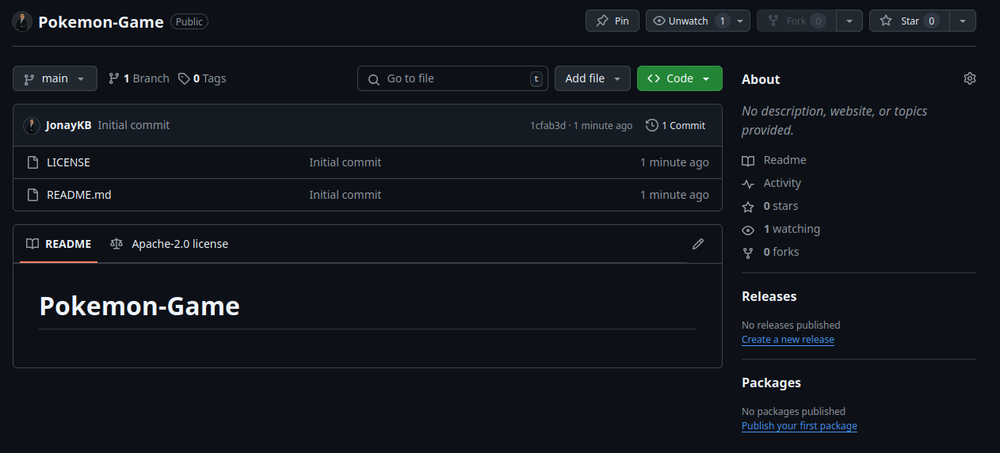

### 2. Crea un proyecto en VueJS

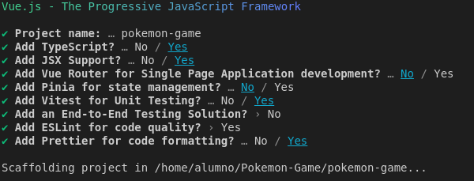

#### ¿Para qué sirve Vue Router, Pinia, Vitest, ESLint y Prettier?
- Vue Router: Permite la creacion de aplicaciones de pagina unica (SAP), añadiendo un router que permite cambiar entre componentes.
  
- Pinia: Es un similar al contexto en react, te permite compartir informacion entre componentes o paginas(usando SAP).
  
- Vitest: Te permite la creacion de tests.

- ESLint: Ayuda a mejorar la calidad del codigo, creando recomendaciones en zonas de codigo basura, para mejorarlo.

- Prettier: Ayuda con el formateo de documentos de vue.

#### Para continuar, ejecutamos los comandos y comprobamos que nuestra aplicación VueJS funciona correctamente.

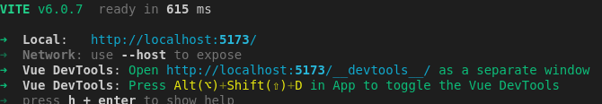

#### ¿Qué es Composition API y en qué se diferencia de Option API en VueJS?

Composition API es mas novedoso, y es una manera de usar VueJS funcional, similar a como en otros frameworks, como react, usando referencias en memoria o objetos reactivos.

Mientras que Option API es la manera tradicional de VueJS, esta mas estrcuturado, pero tiene algunas limitaciones respecto a Composition API.

#### ¿Qué es screaming architecture y qué ventajas tiene?

La "screaming architecture", signficaria como estructuras que gritan su significado, estas estan divididas de una manera que cada parte "grita" (o dice) lo que es. Un ejemplo, seria en VueJS, el paquete components, grita lo que es, que tiene componentes.

Esta architectura es muy util, ya que permite, sin mucho esfuerzo, entender la estructura de un proyecto.

### Ahora, vamos a modificar y borrar todo lo que no necesitamos que nos ha creado de forma automática VueJS

#### Vaciar App.vue
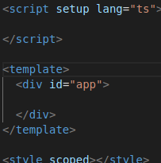

#### Recuerda que vamos a utilizar TS en lugar de JS, ¿cómo se lo indicamos a Vue?
Como vemos en la foto anterior, podemos observar que donde pone lang, tenemos igualado a "ts", eso significa que usara TypeScript para los scripts.

#### Añade un mensaje de Hola mundo en App.vue
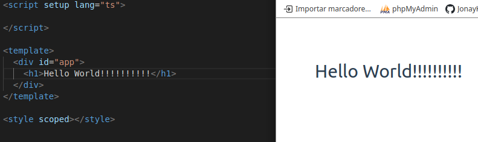

#### En la carpeta de assets, borra los archivos base.css y logo.svg

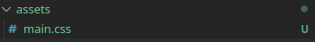

#### Cambia el nombre de main.css de la carpeta assets a styles.css y modifica la ruta en el archivo main.ts para que funcione correctamente nuestra hoja de estilo
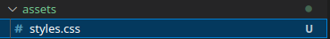

#### Ejecuta el comando npm run dev y muestra el resultado
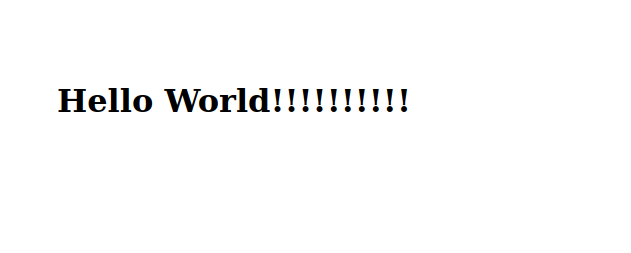

### Para realizar nuestra aplicación en lugar del framework de CSS Bootstrap, vamos a usar Tailwind CSS, ¿lo conoces?
Si, es como bootstrap, un framework que ayuda a crear el css de la pagina.

#### Configura el proyecto para hacer uso de Tailwind CSS.
Instalar Tailwind Css:
```bash
npm install -D tailwindcss postcss autoprefixer
npx tailwindcss init -p
```
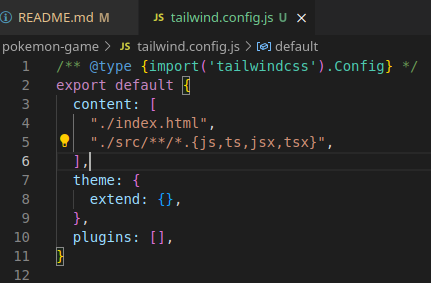

Crear css ./src/index.css y añadir
```css
@tailwind base;
@tailwind components;
@tailwind utilities;
```

E importarlo a src/main.js
main.js:
```ts
import './assets/styles.css'

import { createApp } from 'vue'
import App from './App.vue'
import './index.css'
createApp(App).mount('#app')
```

Modificar la configuracion de tailwind en tailwind.config.js
```ts
/** @type {import('tailwindcss').Config} */
export default {
  content: [
    './src/**/*.{html,js,vue,ts}',
    './index.html',
    './public/index.html',
  ],
  theme: {
    extend: {},
  },
  plugins: [],
}
```

#### Muestra el nuevo resultado del mensaje Hola mundo que creamos anteriormente, ¿se parece a esto?
Sí, igualito

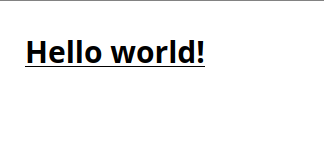

## Reto 2
 
### Anteriormente, ya habíamos borrado y modificado un par de archivos, pero, ¿cumplimos con la filosofía de screaming architecture? Te digo la respuesta, no. Por tanto, vamos a seguir modificando nuestra estructura del proyecto:

#### Sin miedo, borramos por completo la carpeta de components.
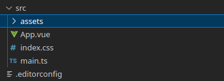

#### Crea una nueva carpeta dentro de src llamada modules, y dentro de esta una llamada pokemon, de tal forma que tendríamos src/modules/pokemon.
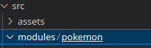

### Dentro de la carpeta de pokemon vamos a tener todos los archivos que estén relacionados con nuestro juego de pokemon. La mayor parte de nuestro código irá dentro de esta carpeta.

#### Creamos una nueva carpeta llamada composables, ¿qué es un composable en VueJS y cual es la nomenclatura común que se utiliza en los ficheros que contiene?
Los composables son utilidades que van a ser reutilizadas en distitnas partes del codigo, un ejemplo serian las llamadas a la API.

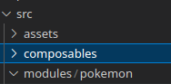

#### Creamos una nueva carpeta llamada components.
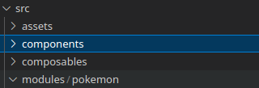

#### Creamos una carpeta de views.
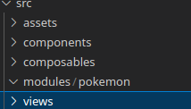

### Dentro de la carpeta de views, vamos a crear el archivo PokemonGame.vue, ¿cuál crees que será la lógica que irá dentro de este archivo?
Dentro de este archivo estara las vistas principales, que consinstira de cada pantalla.

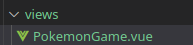
#### Genera la estructura básica de vue dentro de este archivo. Recuerda que estamos trabajando con Typescript y Composition API.
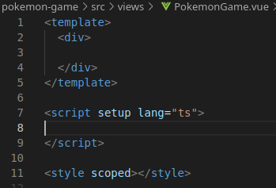
#### ¿Conoces algún atajo para generar esta estructura de forma automática? ¿Con qué extensión y cuál?
Si, poniendo "vbase-3-ts-setup" generara la estructura basica usando typescript y poniendo el setup.

### Usando la etiqueta <section> de HTML, vamos a dividir nuestro template. Tendremos:

#### Una sección que tenga un mensaje que indique al usuario que: Espere por favor y Cargando Pokémons. De tal manera que:
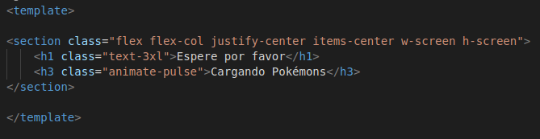

#### ¿Para qué sirven las clases que hemos añadido?

Son los estilos de tailwind:
los primeros ponene que es flex y el tipo, despues que la altura y la anchura se ajuste a la pantalla.
En h1, poneemos que el texto sea grande.
Y en el h3, que tenga una animacion.

### Saca una captura de como se ve actualmente nuestra aplicación. ¿No ves los cambios? Algo se te olvida... ¿qué es? Indica los archivos que has tenido que modificar.

Hay que añadir el component a App.vue

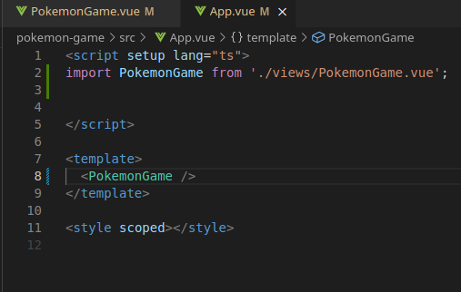

#### Si todo ha ido bien, tu aplicación tendría que verse tal que así:
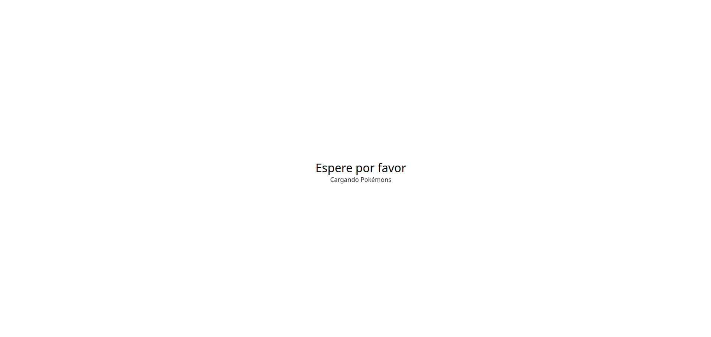

#### Utilizando una directiva de VueJS, ¿cómo ocultaríamos esta sección por completo?
Usando un v-show, a una referencia que podemos cambiar a nuestro gusto.

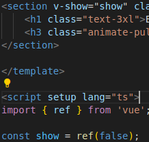

### Ahora, vamos a crear otra nueva sección igual a la anterior pero que muestre al usuario el mensaje: ¿Cuál es este Pokémon?
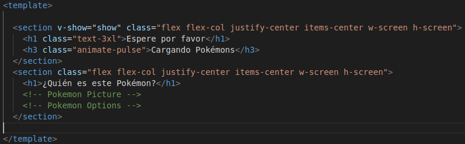
#### Añade las mismas clases que utilizamos en la sección anterior.
#### En esta sección añadiremos dos componentes: Pokemon Picture y Pokemon Options, ¿para qué crees que sirven? ¿Te aventuras a intentar averiguar cual será la lógica que implementemos en ellos?
Uno sera la imagen del pokemon y otra las opciones a elegir 

## Reto 3

### PokemonPicture.vue

#### Lo que vamos a hacer en este componente es importar directamente desde PokeApi una imagen de un pokemon (Ditto para ser más exactos).

#### Siguiendo la misma forma que en PokemonGame.vue de las secciones, en este componente nos crearemos una sección que contendrá una imagen del pokemon Ditto. (No es necesario realizar la conexión directamente a la API, copia y pega la url de la imagen y muéstrala).

#### El resultado de todos los pasos anteriores debe ser el siguiente:
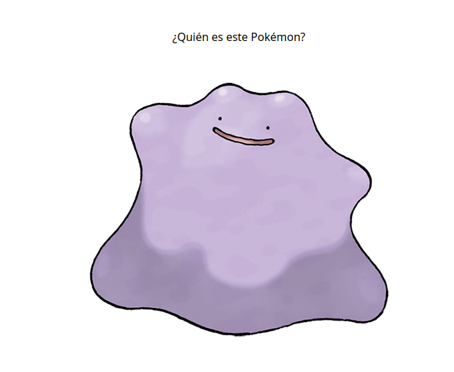

#### Ahora bien, nosotros queremos que inicialmente la imagen de nuestro Pokémon esté completamente oculta como en la imagen del resultado final, ¿cómo hacemos esto? utilizando una clase de Tailwind CSS llamada brightness-0. Comprueba que la imagen de tu Pokémon ahora mismo esté completamente negra. Añade también la clase h-[200px], ¿para qué sirve?
Mantiene a 200px la altura

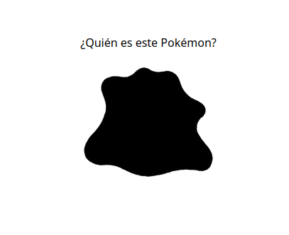

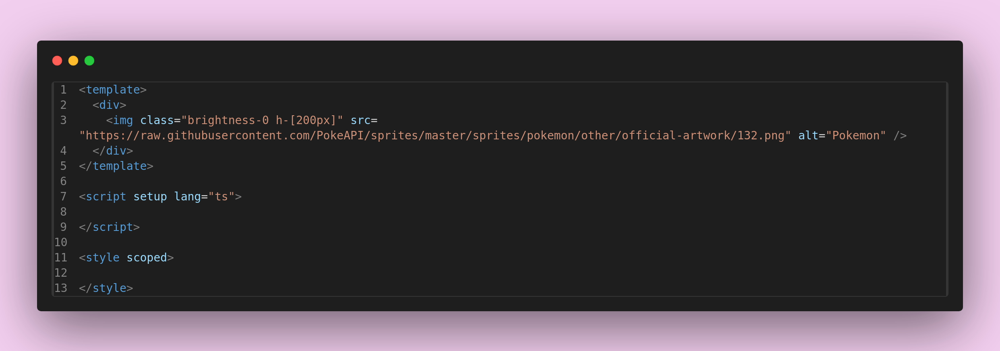
### PokemonOptions.vue

#### En una nueva sección vamos a "simular" lo que serían las opciones de los Pokémon. Esto lo vas a hacer creando una lista de HTML tal y como se muestra en la imagen final. 

#### Ahora, mediante clases css de tailwind, dale aspecto de botones a esa lista. Recuerda que para aplicar clases de Tailwind desde la etiqueta de styles tendrás que usar @apply. ¿Lo conseguiste?
Si, asi:

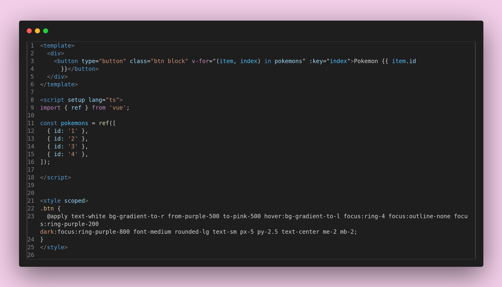
### El color de fondo de nuestra aplicación es: #f1f1f1, para aplicarlo, ¿dónde debes colocar el código css correspondiente? aplícalo y muestra los cambios.

Hay que aplicarlo al body del archivo index que contiene la app, aqui:

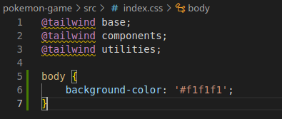